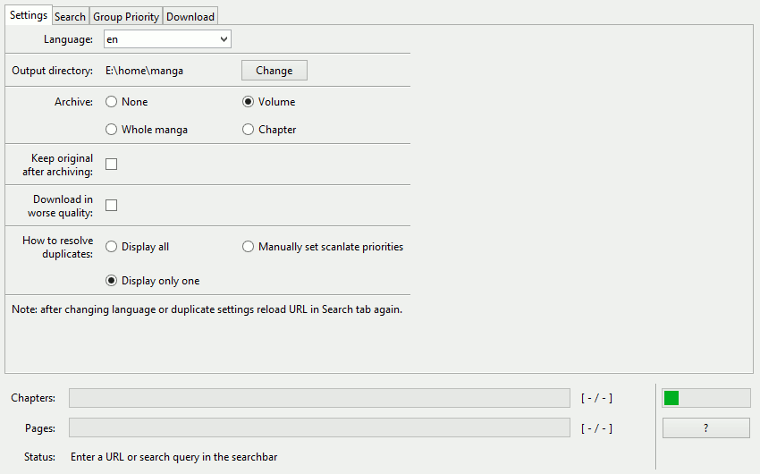

# mangadex-dl
A Python package to download manga from [MangaDex.org](https://mangadex.org/).

## Requirements
  * [Python 3.8+](https://www.python.org/downloads/) (or [install via Homebrew](https://docs.python-guide.org/starting/install3/osx/) on macOS)

## Installation & usage
```
$ git clone https://github.com/Uwuewsky/mangadex-dl
$ cd mangadex-dl/
$ python -m mangadex_dl [-g] [-l language_code] [-o directory] [-s] [-a manga|volume|chapter] [-k] [-r all|one|manual] [-d range] [manga_urls]
```

### Optional flags
* `-g`: Runs a program in GUI mode.
* `-l`: Download releases in a language other than English. For a list of language codes, see the [wikipedia page](https://en.wikipedia.org/wiki/List_of_ISO_639-1_codes).
* `-o`: Use a custom output directory name to save downloaded chapters. Defaults to current directory.
* `-s`: Download page images in lower quality (higher JPG compression/"data saver").
* `-a`: Package downloaded chapters into .zip files. Values: `manga` (zip all manga), `volume` (zip all volumes separately), `chapter` (zip all chapters).
* `-k`: Keep original files after archiving.
* `-r`: Remove duplicate chapters from list. Values: `all` (return list as is), `one` (default, delete from list all duplicates), `manual` (see below).
* `-d`: Setup download range. Used for non-interactive program execution.

### How can I download a chapter from a specific scanlate group?
If duplicate chapters are found in the list of chapters, you can choose: download all available chapters; download only one copy; manually specify group priorities. Set the desired group to the highest priority and only the chapter from this group will be downloaded if possible.

### Archiving feature
The archive function uses the entire manga directory, not just the part you downloaded during the current run; it will archive all existing folders according to the specified flag. If you need to keep downloaded files without archiving, specify a different output directory.

### Download range format
Here are some examples of valid downloading range input:
* `v1`: Download all volume 1;
* `v1(3)`: Download chapter 3 from volume 1;
* `v1-v5`: Download volumes 1-5;
* `v1(3)-v5`: Download from chapter 3 to volume 5;
* `v1(3)-v5(66)`: Download from chapter 3 to chapter 66;
* `v1,v4-v5,v8(99)`: Can be combined with a comma;
* `vu`: Some chapters do not have a volume. Therefore, they appear in vu (Volume Unknown);
* `v0(Oneshot)`: Download oneshot;
* `all`: Download whole manga.

Also some examples of INVALID input:
* `1,2,3`: Obsolete format;
* `v1(1,2,3-6)`: You cannot specify more than one chapter in parentheses, use the example above.

### Example usage
Run the program in graphical mode:
```
$ python -m mangadex_dl -g
```

Or in the console version:
```
$ python -m mangadex_dl -a chapter

Enter URL or text to search by title. (leave blank to complete)
> yotsuba

Enter URL or text to search by title. (leave blank to complete)
> 

Receiving manga's info...
The following titles were found on request:
 1. Yotsuba&! (2003) by Azuma Kiyohiko
 2. Mahouka Koukou no Rettousei - Yotsuba Keishou-hen (2020) by Satou Tsutomu
 3. Try! Try! Try! (2001) by Azuma Kiyohiko
 4. Kimi ni, Yotsuba (2018) by Akino Kabocha
 
Insert number (leave blank to cancel):
> 1

[ 1/ 1] TITLE: Yotsuba&!

Available chapters: (total 119)
Volume 1 :      1     2     3     4     5     6     7
Volume 2 :      8     9    10    11    12    13    14
Volume 3 :     15    16    17    18    19    20    21
Volume 4 :     22    23    24    25    26    27  27.5
Volume 5 :     28    29    30    31    32    33    34
Volume 6 :     35    36    37    38    39    40    41
Volume 7 :     42    43    44    45    46    47    48
Volume 8 :     49    50    51    52    53    54  54.2    55
Volume 9 :     56    57    58    59    60    61    62
Volume 10:     63    64    65    66    67    68    69  69.2
Volume 11:     70    71    72    73    74    75    76
Volume 12:     77    78    79  79.2    80    81  81.2  81.3    82
Volume 13:     83    84    85    86    87    88    89    90
Volume 14:     91    92    93    94    95    96    97
Volume 15:     98    99   100 100.2   101 101.2   102 102.2   103   104 104.2
Volume Unknown:    105   106   107   108   109

Enter chapters to download:
(see README for examples of valid format) (leave blank to cancel)
> v15(103)-v15(104.2)

Downloading chapter [  1/  3] Ch.103 Yotsuba & Books
  Downloaded images [  1/ 20]...
  [Text omitted...]
Chapters download completed successfully

Archive downloaded chapters...
  Archiving [  3/  3]...
Archiving completed successfully

Manga "Yotsuba&!" was successfully downloaded
```

Instead of command-line options and manually inserting manga links, you can use a file redirection with some options:
```
$ python -m mangadex_dl -d all < list.txt
```

## License
[GPLv3](https://www.gnu.org/licenses/gpl-3.0.html)
